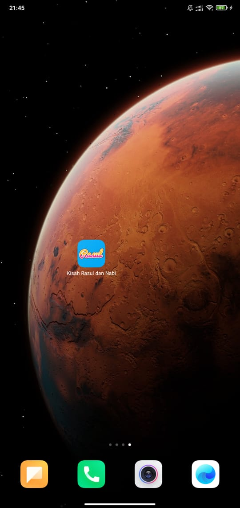
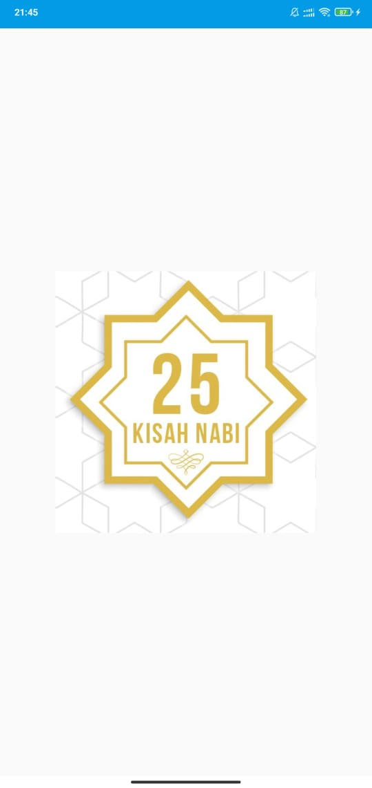
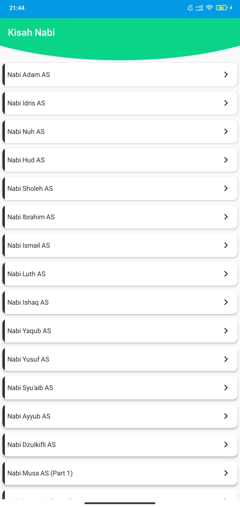
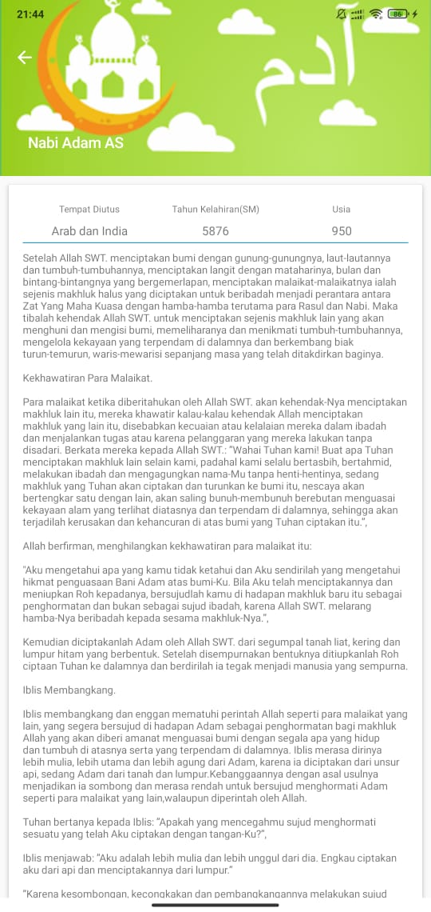
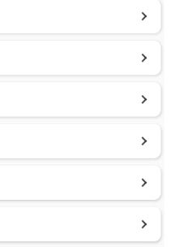

# Pemrograman Mobile

|  |  |
|--|--|
| Dosen Pengampu | [Habibie Ed Dien, S.Kom., M.T.](https://github.com/hbb-polinema) |
| Tahun Ajaran | Ganjil 2020/2021 |
| Email | habibie@polinema.ac.id |
| Institusi | jti.polinema.ac.id |

## Data Diri

|  |  |
|--|--|
| NIM | **1841720186** |
| Nama Lengkap | **Adie Bagus Satrio** |
| Kelas | **TI-3E** |

## Judul/Nama Aplikasi

|  |  |
|--|--|
| Nama Aplikasi | **Kisah Nabi dan Rasul** |
| Link Source Code | () |
| Bahasa Pemrograman | **Java** |

## Deskripsi Aplikasi

Dibuatnya aplikasi ini untuk menumbuhkan minat membaca 
Untuk segala kalangan terutama anak-anak kecil dan remaja yang tengah menjalani kuliah Online agar selalu dapat mudah mengakses informasi tentang kisah-kisah nabi pada saat di waktu senggang pada smartphone

## Fitur Aplikasi

##### 1.IC Launcher

##### 2.Splash Screen

##### 2.Recycle View

##### 2.Text View

##### 2.Navigation

## Saran

Menambahkan fitur Search
Fitur Login / Logout
Fitur Share Sosmed
Fitur Riwayat Baca

## Kesimpulan

Jadi aplikasi ini saya rancang dengan berbasis android yang berisi tentang informasi tentang kisah-kisah nabi dengan interface aplikasi yang sangat mudah di pahamai dan sangat simple bagi pengguna nantinya.

## Refrensi

| Nama Fitur | Link Source Code / Refrensi |
|--|--|
| Ic Launcher | https://developer.android.com/studio/write/image-asset-studio?hl=id |
| Recycle View | https://developer.android.com/codelabs/android-training-create-recycler-view#3 |
| Text View | https://developer.android.com/reference/kotlin/android/widget/TextView |
| Splash Screen | https://www.youtube.com/watch?v=H4mCD6s_WrA |

## Pernyataan Diri

Saya menyatakan isi tugas akhir, kode program, dan laporan praktikum ini dibuat oleh saya sendiri. Saya tidak melakukan plagiasi, kecurangan, menyalin/menggandakan milik orang lain.

Jika saya melakukan plagiasi, kecurangan, atau melanggar hak kekayaan intelektual, saya siap untuk mendapat sanksi atau hukuman sesuai peraturan perundang-undangan yang berlaku.

Ttd,

***Adie Bagus Satrio***
